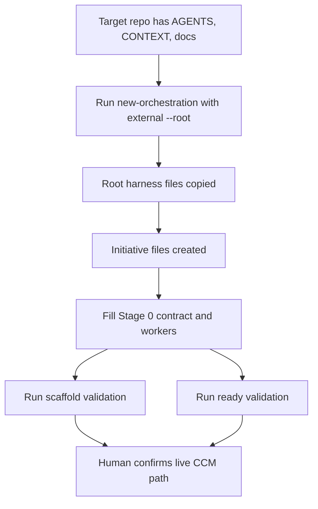

# Dogfood Report: orchestration harness on ws-tag

## Diff Summary

This dogfood tested the CCM Git-backed orchestration harness against `/home/yijwang/ws-tag`, a design workspace with initial `AGENTS.md`, `CONTEXT.md`, and `docs/` context but no Guiding Principal / Orchestrator bootstrap yet.

The run exercised external-repo bootstrap, target-root validation, placeholder-free readiness validation, the minimal Stage 0 coordination path, and a live Slack worker-room smoke test.

## Personas

- Guiding Principal: needs durable owner intent, quality bars, non-goals, and decision boundaries before answering recall or approving stage progression.
- Orchestrator: needs portable root instructions, state machine, templates, intake, repo policy, stage contract, worker index, and one next action before live room lifecycle.
- Worker: needs bounded tasks with deterministic `worker_task_id` and `desired_room_name` before room creation.
- Human operator: needs explicit gates for live CCM parent room, `isOrchestrator: true`, coordination branch, and push/room authorization; human or Guiding Principal worker-room involvement is optional inspection or degraded recovery, not a normal orchestration step.

## Product Intent Clarification

The harness goal is not merely to create visible worker rooms. The goal is to improve delivery throughput by letting humans and the Guiding Principal keep hands on direction, context, quality bars, framing, and key review while the Orchestrator handles routine execution: worker dispatch, low-level sequencing decisions, worker-room control, evidence capture, integration/rejection, cleanup, and archive timing. Any UX that requires the human or Guiding Principal to manually operate worker rooms moves work back to the steering layer and is therefore an orchestration failure unless explicitly labeled degraded recovery.

## Flows Tested

## Test Matrix & Results

| Scenario | Result | Evidence |
| --- | --- | --- |
| Bootstrap an initiative into `/home/yijwang/ws-tag/docs/orchestration` | Fixed | `scripts/new-orchestration.ts` now copies root `AGENTS.md`, `state-machine.md`, and `_templates/` when `--root` points outside this repo. |
| Validate an external orchestration root | Fixed | `scripts/validate-orchestration.ts --root /home/yijwang/ws-tag/docs/orchestration` now validates the target root instead of silently validating the harness repo. |
| Check dispatch readiness separately from scaffold shape | Fixed | `scripts/validate-orchestration.ts --ready` fails unresolved template placeholders and passes the concrete `ws-tag` Stage 0 initiative. |
| Re-run `new-orchestration` for later initiatives under the same target root | Fixed | Matching root harness files are reused without requiring `--force`; initiative files still remain protected from overwrite. |
| Preserve minimal effective path for `ws-tag` | Pass | Target has intake, stage, workers, state, repo policy, root instructions, state machine, and templates; no inbox/recall/audit/recovery artifacts were added unnecessarily. |
| Avoid unauthorized live lifecycle operations | Pass | `ws-tag` `state.md` blocked live room creation until the human confirmed parent room and `isOrchestrator: true`. |
| Create a live Slack worker room from the parent Orchestrator room | Partial | `live-room-smoke-001` created `slack:C0B9STRH36F` from parent `slack:C0B9RBB2G6A`; fallback Slack task delivery succeeded. |
| Run worker execution without human/Guiding Principal worker-room intervention | Implementation added; live retry pending | The dogfood exposed that CCM `reply`/`fetch_thread` timed out and no autonomous Worker Report appeared. The harness now exposes parent-room `bind_worker_room`, `start_worker_agent`, `send_worker_task`, and `capture_worker_report`; the live worker execution path still needs a fresh retry before it can be counted as proven. |

## What Was Fixed

1. External root bootstrap copied only initiative files, leaving the target without root orchestration instructions and templates. Fixed by copying idempotent root harness files before creating an initiative.
2. Validation ignored `--root`, which could produce a false positive by validating the harness repo instead of the target repo. Fixed by parsing `--root` and reporting target paths.
3. Validation required template-only `worker_task_id` text in concrete `workers.md`, blocking real worker rows. Fixed scaffold validation to check table shape, then added `--ready` for placeholder-free dispatch gates.
4. Reusing an existing target root required `--force` even when copied harness files were identical. Fixed by allowing identical root files/templates to be reused while preserving no-overwrite behavior for initiative files.
5. Agent Control Path guidance and MCP surface previously over-focused on create/archive. Fixed docs, prompts, checklists, schema, daemon handling, and tests to include parent-controlled `bind_worker_room`, `start_worker_agent`, `send_worker_task`, and `capture_worker_report`.
6. The broader root cause was an under-specified role model: human/Guiding Principal are strategic steering and key review, not routine worker-room operators. Fixed the authority model and prompt/skill guidance to require autonomous Orchestrator execution from durable context.
7. The first bind/start/send patch allowed two semantic leaks: relative `cwd` normalization and hidden lazy-start from `send_worker_task`. Fixed by requiring absolute cwd and requiring `start_worker_agent` before send.

## Paper Cuts

- `--root` means orchestration root, not repo root. README and bootstrap skill now call this out with `<repo>/docs/orchestration` examples.
- A target symlink such as `/home/yijwang/ws-tag -> /home/repo/ejwang/ws-tag` can confuse manual inspection. The current Stage 0 files use the user-facing path; future harness work could record both canonical and requested paths.
- A repo with no `git remote` needs an explicit policy label instead of fake remote evidence. The `ws-tag` repo policy records `local-design-workspace` and blocks push.
- Live room creation alone can look deceptively successful. The harness now treats create/archive-only support as incomplete and exposes parent-controlled bind/start/send/capture; live capture/reportback still needs retry evidence before claiming the full lifecycle.

## Decisions For A Human

- Already confirmed during the dogfood: preserve bootstrap, use `agent-control-testing` as the live CCM parent room, treat the parent room as the confirmed Orchestrator, coordinate on `main`, allow live worker rooms, and do not commit.
- Do not ask a human or Guiding Principal to participate in worker-room execution as the normal path. If manual worker-room intervention is needed, record it as degraded recovery or orchestration failure.
- Decide whether to retry `live-room-smoke-001` with `bind_worker_room`, `start_worker_agent`, `send_worker_task`, and `capture_worker_report`, or abandon/archive the original smoke as superseded evidence.

## Learnings

Portable orchestration needs more than initiative files. A different repo must receive the root instructions, state machine, and templates, otherwise Orchestrator and Worker prompts point to missing local authority.

Scaffold validation and ready-to-dispatch validation are different gates. Scaffold validation should allow placeholders; ready validation should fail them.

Human/Guiding Principal presence in worker rooms is not an expected execution dependency. It is acceptable for interest-driven inspection, but required intervention to bind, start, prompt, debug, or unblock worker execution means the Orchestrator/Agent Control Path failed to provide the intended UX.

## Final Status

Local bootstrap, local Stage 0 worker audits, external-root validation, live Slack worker-room creation, and parent-controlled bind/start/send/capture implementation are in place. Full live worker-room lifecycle remains unproven until a fresh live retry captures an autonomous Worker Report; the fallback that asks a human or Guiding Principal to operate inside the worker room remains explicitly classified as degraded recovery/orchestration failure, not success. Verification passed with `bun run validate`, `bun scripts/validate-orchestration.ts --root /home/yijwang/ws-tag/docs/orchestration --ready`, and `git -C /home/yijwang/ws-tag diff --check -- docs/orchestration`.
