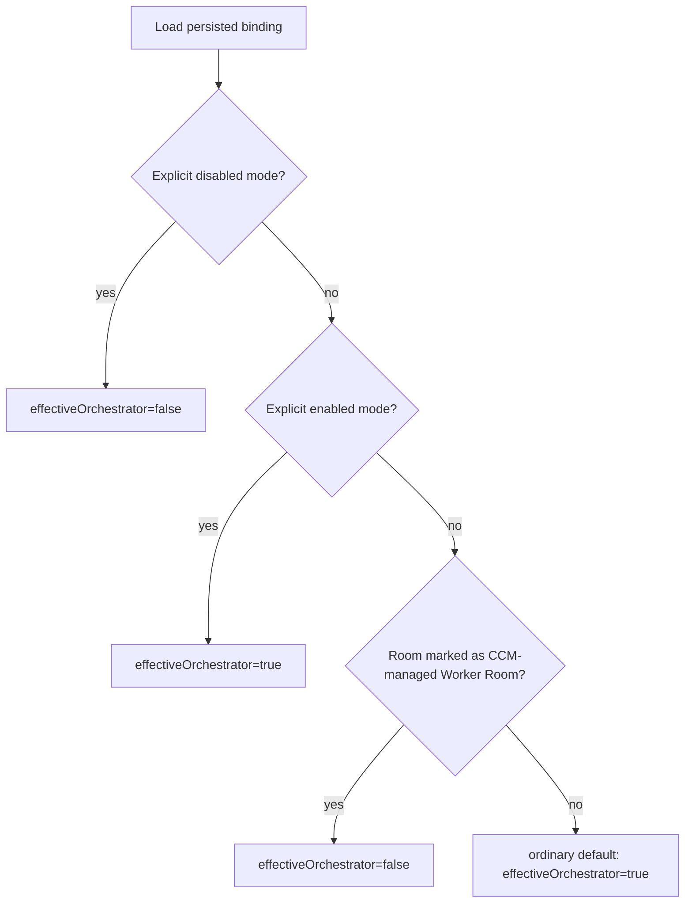

# feat: Default ordinary rooms to orchestrator-capable

## Summary

Make ordinary CCM rooms orchestrator-capable by default while preserving the boundaries that keep orchestration safe: Worker Rooms created, adopted, or bound by CCM lifecycle operations are forced non-orchestrators by default; a human operator may later explicitly enable orchestration on that room through a guarded command path, and users can explicitly disable orchestration for any ordinary room. The implementation should pair the default capability expansion with a documented dispatch policy so Orchestrators decide when to stay single-agent, create visible Worker Rooms, use worker-local internal fan-out, or stop for more context.

The change is intentionally not “every room gets unrestricted control.” It is “ordinary parent rooms default to Agent Control Path capability; CCM-managed Worker Rooms are worker-forced-disabled unless a human operator performs an explicit break-glass enable, and explicitly disabled rooms remain disabled.”

---

## Problem Frame

Today orchestration is opt-in through the persisted Orchestrator Room Flag. That protects the control plane, but it makes the intended hands-off orchestration flow depend on a manual `/ccm orch on` setup step even when the user’s request is clearly orchestration-shaped. The desired direction is to reduce that ceremony and let the default parent-room experience be orchestration-capable, while also improving the policy that decides whether work should use visible Worker Rooms or lighter local/dynamic techniques.

The main constraint is that default-on expands capability. The plan must not let Worker Rooms inherit lifecycle authority, erase the ability to disable orchestration, or allow hidden subagents to be counted as successful Worker Room execution.

---

## Requirements

### Capability Defaults

- R1. Ordinary CCM rooms without an explicit orchestration setting are treated as Agent Control Path capable.
- R2. Users can explicitly disable orchestration for a room, and that disabled state persists across daemon restarts and binding serialization.
- R3. Existing explicit enabled rooms are migrated to `orchestratorMode: "enabled"` and continue to behave as enabled rooms after startup migration.
- R4. Existing ordinary rooms without an explicit setting are migrated into the new schema once existing or potentially existing Worker Rooms have been identified and persisted as worker-forced-disabled.

### Worker-Room Boundaries

- R5. Worker Rooms created, adopted, or bound through Agent Control Path are explicitly non-orchestrators, regardless of the ordinary-room default.
- R6. Worker Rooms do not inherit parent-room orchestration capability.
- R7. An authenticated human operator can explicitly enable orchestration on a Worker Room later through a guarded break-glass command path, but worker lifecycle operations and agent-originated messages must not do that implicitly.

### Dispatch Policy

- R8. Orchestrator-facing docs and prompts define when to use single-agent execution, visible Worker Rooms, worker-local internal fan-out, orchestration meta-work fan-out, `ask_peer`, or `attention_needed`.
- R9. Dispatch policy considers task independence, dependencies, concurrency value, expected context demand, current context pressure, compaction/corrosion risk, auditability, and explicit user preference.
- R10. Prompt-level execution preferences may bias dispatch choices but cannot override hard boundaries: hidden subagents are not CCM Worker Rooms, Worker Rooms are not controllers, and missing current CCM context is still a control-path failure.

### Observability and UX

- R11. `/ccm orch status|on|off` explains default-enabled, explicitly enabled, explicitly disabled, and worker-forced-disabled states without requiring the user to understand persisted schema details.
- R12. Agent-facing context continues to show enough room metadata for agents to distinguish ordinary default-enabled parent rooms, explicitly disabled rooms, and worker-forced-disabled Worker Rooms when that distinction matters.

---

## Key Technical Decisions

- **Use an explicit orchestration mode plus room-role source instead of overloading a boolean.** A boolean `isOrchestrator` cannot distinguish “unset therefore default-on” from “explicitly off” or “disabled because this is a CCM-managed Worker Room.” Add or derive capability state such as `orchestratorMode: "enabled" | "disabled"` plus a distinct worker source such as `roomRole: "worker"`, while migrating existing `isOrchestrator` data into the new schema at startup.
- **Migrate old missing state to default-enabled only after worker protection.** Avoid destructive rewrites, but do not silently re-authorize existing Worker Rooms. Add a startup migration that marks identifiable ACP-created Worker Rooms as worker-forced-disabled before ordinary missing state becomes default-enabled. After migration, only the new schema is supported for persisted bindings.
- **Make Worker Rooms explicitly worker-forced-disabled.** Agent Control Path create/adopt/bind paths should persist both a disabled capability mode and the worker-role source for Worker Rooms, including create-only rooms before bind/start. This prevents the new default from re-authorizing rooms that were intentionally ordinary execution surfaces.
- **Keep CCM Core semantically minimal.** Do not store worker mappings, stage state, or task ownership in CCM Core. This change is about room lifecycle capability, not orchestration workflow ownership.
- **Document dispatch as policy, not token arithmetic.** The repo currently has compaction lifecycle signals but no reliable provider-agnostic “remaining context” metric. The first version should use qualitative context-pressure criteria and leave numeric thresholds deferred until the runtime surfaces prove stable.

---

## High-Level Technical Design

### Capability Resolution

### Dispatch Decision Matrix

| Condition | Preferred execution mode | Rationale |
|---|---|---|
| Small, tightly coupled, low context pressure | Single default agent | Avoid worker-room overhead. |
| Independent subtasks with clear outputs | Visible Worker Rooms | Parallelize while preserving inspectability. |
| Worker task is broad and already in a visible Worker Room | Worker-local internal fan-out | Improve throughput without counting hidden subagents as rooms. |
| Planning, prompt QA, report reconciliation, evidence gap checks | Orchestrator-local meta-work fan-out | Preserve main context while keeping stage execution visible. |
| User asks for a specific execution mode | Bias toward that mode | Honor preference unless it violates hard boundaries. |
| Missing or ambiguous current CCM context | `attention_needed` | Do not guess room authority or fall back to hidden execution. |
| High compaction/corrosion risk with independent work | Visible Worker Rooms or worker-local fan-out | Shift context-heavy work to fresh visible surfaces. |

---

## Implementation Units

### U1. Introduce explicit orchestration capability mode and worker role source

- **Goal:** Represent effective orchestration capability as a defaultable mode with a distinct worker-role source rather than a legacy boolean only.
- **Requirements:** R1, R2, R3, R4, R11, R12
- **Dependencies:** None
- **Files:** `bindings.ts`, `test/bindings.test.ts`
- **Approach:** Extend the binding model with an explicit mode or equivalent persisted marker and a distinct worker-role source. Normalization should return both the effective boolean needed by current callers and enough persisted state to distinguish default enable, explicit enable, explicit disable, malformed explicit mode, and worker-forced-disabled. Serialization should omit default ordinary state when possible, preserve explicit enable for backwards clarity when present, and preserve explicit disable or worker role because each carries control-plane intent.
- **Patterns to follow:** Existing `normalizeBinding`, `serializeBinding`, `setBindingOrchestratorFlag`, and malformed persisted state filtering in `bindings.ts`.
- **Test scenarios:**
  - Missing orchestration fields normalize to effective enabled for ordinary room bindings.
  - Legacy `isOrchestrator: true` migrates to `orchestratorMode: "enabled"` and serializes only in the new schema.
  - Explicit disabled mode normalizes to effective disabled and survives serialize/parse.
  - Empty default binding does not create unnecessary persisted state unless explicit disabled must be stored.
  - Missing mode defaults enabled for ordinary rooms; malformed explicit mode fails closed to effective disabled and emits or records a compatibility warning.
- **Verification:** Binding tests prove default-on ordinary behavior, explicit off persistence, and one-time legacy migration into the new schema.

### U2. Preserve worker-room forced-off behavior

- **Goal:** Ensure Agent Control Path worker rooms are explicitly worker-forced-disabled as orchestrators under the new default-on model.
- **Requirements:** R5, R6, R7
- **Dependencies:** U1
- **Files:** `daemon.ts`, `test/orchestration-harness.test.ts`, `test/room-control-daemon.test.ts`, `test/orchestrator-runner.test.ts`
- **Approach:** Update worker create/adopt/bind paths to persist explicit disabled orchestration mode plus worker-role source for the worker room. `create_room_with_bot_invited` should persist a minimal worker-room binding for the returned room id with disabled capability even before cwd/runtime/session metadata exist. Keep the existing parent-controlled lifecycle ordering: create or adopt, bind, start, send, capture. The worker exception should be represented in binding state rather than inferred only from transient call flow.
- **Patterns to follow:** Current `bind_worker_room` handling, `setRoomOrchestratorFlag`, lifecycle assertions around `assertOrchestratorRoom`, and tests that pin “worker rooms do not inherit `isOrchestrator`.”
- **Test scenarios:**
  - `create_room_with_bot_invited` stores a minimal worker-forced-disabled binding for create-only rooms before bind/start.
  - `bind_worker_room` stores explicit worker disabled capability even when ordinary rooms default enabled.
  - `start_worker_agent` and `send_worker_task` still require parent Orchestrator authority.
  - A worker room does not become authorized merely because it has cwd/runtime/default-agent metadata.
  - A later explicit user enable can still mark that room as enabled through the normal command path.
- **Verification:** Daemon and harness tests prove Worker Rooms remain non-controllers while parent rooms can still dispatch.

### U3. Update `/ccm orch` command UX and status text

- **Goal:** Make the user-facing controls understandable after default-on semantics land.
- **Requirements:** R2, R11
- **Dependencies:** U1
- **Files:** `commands.ts`, `daemon.ts`, `test/orchestrator-command.test.ts`, `README.md`
- **Approach:** Keep `on`, `off`, and `status`, but make status report the effective capability and whether it came from default, explicit enable, explicit disable, or worker-forced-disabled state. `off` should persist explicit disable. `on` should persist explicit enable or clear explicit disable according to the chosen schema, as long as status stays unambiguous. Commands that change orchestration mode should be accepted only from authenticated human/operator-originated room commands; enabling a worker-forced-disabled room requires a break-glass confirmation and audit-visible notice.
- **Patterns to follow:** Current command parsing for `ccm orch|orchestrator`, default-agent command notices, and room lifecycle UX docs.
- **Test scenarios:**
  - `ccm orch status` recognizes default-enabled ordinary rooms.
  - `ccm orch off` persists explicit disabled state and status reports disabled.
  - `ccm orch on` re-enables a previously disabled room.
  - Status messaging for worker-forced-disabled rooms does not imply the worker inherited parent authority.
  - Agent-originated messages cannot enable orchestration, and worker-room enablement requires a human break-glass confirmation.
- **Verification:** Command tests and README examples cover the new UX vocabulary.

### U4. Add orchestration dispatch policy documentation

- **Goal:** Document how an Orchestrator chooses between single-agent execution, visible Worker Rooms, internal fan-out, peer collaboration, and stopping for context.
- **Requirements:** R8, R9, R10
- **Dependencies:** None
- **Files:** `docs/checklists/orchestrator-preflight.md`, `docs/checklists/worker-dispatch.md`, `skills/orchestrate-workers/SKILL.md`, `prompts/ccm/orchestrator.md`, `prompts/ccm/worker.md`, `test/orchestration-harness.test.ts`
- **Approach:** Add a compact decision matrix and override hierarchy to the existing orchestration surfaces. The policy should explicitly say user preference biases the choice, but hidden subagents do not count as Worker Rooms and missing current context remains a stop condition. Worker prompts should continue to allow worker-local fan-out only inside the already-started visible room and require synthesized, verified Worker Reports.
- **Patterns to follow:** Existing “generic subagent requests resolve toward visible rooms,” preflight checklist hard stops, and worker prompt internal-throughput language.
- **Test scenarios:**
  - Static harness tests assert the matrix names independence, dependency, concurrency, expected context demand, current context pressure, compaction/corrosion risk, auditability, explicit user preference, `ask_peer`, and `attention_needed`.
  - Static harness tests assert prompt override cannot bypass visible Worker Room requirements for stage worker execution.
  - Static harness tests assert internal fan-out remains worker-local or orchestration-meta only.
- **Verification:** Documentation tests pin the new policy language without weakening existing hidden-subagent guardrails.

### U5. Update agent-facing room context metadata

- **Goal:** Surface enough room capability metadata in agent turns and current-context responses for agents to reason about default-enabled parent rooms versus disabled or worker-forced-disabled rooms.
- **Requirements:** R11, R12
- **Dependencies:** U1, U2, U3, U5
- **Files:** `daemon.ts`, `server.ts`, `agents/codex/app-server-driver.ts`, `agents/claude/channel-driver.ts`, `test/codex-driver-fixtures.test.ts`, `test/server-ipc.test.ts`
- **Approach:** Extend current CCM context and turn-envelope generation with effective orchestration state and role/source information where agents need it. Keep platform history and peer context untrusted; this metadata is daemon-owned control context, not user-provided transcript text.
- **Patterns to follow:** Existing `<ccm_turn>` envelope attributes, `get_current_ccm_context`, Codex app-server turn formatting, and Claude goal passthrough context preservation.
- **Test scenarios:**
  - Codex and Claude turn envelopes include enough metadata to distinguish default-enabled ordinary rooms from worker-forced-disabled Worker Rooms.
  - `get_current_ccm_context` reports effective capability and source without exposing unrelated binding internals.
  - Explicit disabled rooms are visible as disabled to the current agent.
- **Verification:** Agent context tests prove runtime prompts can apply the new dispatch and authority policy.

### U6. Adjust Agent Control Path authorization tests

- **Goal:** Rebaseline tests from explicit opt-in to default-enabled ordinary parent rooms while keeping hard authorization checks meaningful.
- **Requirements:** R1, R5, R6, R10, R12
- **Dependencies:** U1, U2, U3, U5
- **Files:** `test/orchestration-harness.test.ts`, `test/orchestrator-command.test.ts`, `test/room-control-daemon.test.ts`, `test/server-ipc.test.ts`, `test/codex-driver-fixtures.test.ts`
- **Approach:** Update tests that currently assume missing `isOrchestrator` means unauthorized. Replace those assumptions with explicit disabled cases. Preserve coverage for ambiguous current context, unsupported platform behavior, and worker lifecycle sequencing.
- **Patterns to follow:** Existing tests around `room_not_orchestrator`, `get_current_ccm_context`, native goal passthrough, and Worker Room non-inheritance.
- **Test scenarios:**
  - Ordinary parent room without explicit persisted flag can call Agent Control Path when current context resolves.
  - Explicit disabled parent room receives the same failure shape that non-orchestrator rooms used to receive.
  - Ambiguous or missing current context still fails even when ordinary defaults are enabled.
  - Codex and Claude turn envelopes keep enough room metadata for authorization decisions.
- **Verification:** Updated tests prove the authorization model changed intentionally rather than by accidental broadening.

### U7. Update domain docs and compatibility notes

- **Goal:** Align glossary, contracts, and operator docs with default-on semantics.
- **Requirements:** R1, R2, R4, R5, R11
- **Dependencies:** U1, U2, U3, U5, U4
- **Files:** `CONCEPTS.md`, `docs/contracts/agent-control-path-v1.md`, `docs/agent-control-path-v1-operator-checklist.md`, `docs/adr/0001-native-agent-control-path.md`, `README.md`, `test/orchestration-harness.test.ts`
- **Approach:** Revise language that says lifecycle calls require rooms “whose binding has `isOrchestrator: true`” to the new capability vocabulary. Keep the historical note clear: V1 still exposes narrow room lifecycle tools, Worker Rooms still do not inherit control authority, and explicit disable exists for rooms that should remain ordinary.
- **Patterns to follow:** Existing Concepts glossary style and static tests that pin contract language.
- **Test scenarios:**
  - Static tests assert contract docs describe default-enabled ordinary rooms and explicit disabled rooms.
  - Static tests assert Worker Room non-inheritance remains present.
  - Static tests assert migration notes explain that legacy `isOrchestrator` is converted to `orchestratorMode`.
- **Verification:** Docs and tests agree on the new vocabulary and do not leave contradictory opt-in-only language.

---

## Scope Boundaries

### In Scope

- Default-on effective orchestration capability for ordinary CCM rooms, gated by compatibility protection for existing Worker Rooms.
- Explicit disabled state for rooms that should not be orchestrator-capable.
- Forced-off Worker Room semantics for CCM-managed worker lifecycle surfaces.
- Dispatch policy and prompt/docs updates for worker-room vs dynamic fan-out choices.
- Tests that prove the new authorization model and guardrails.

### Out of Scope

- Making hidden subagents count as CCM Worker Rooms.
- Letting Worker Rooms recursively manage peer Worker Rooms by default.
- Storing stage state, worker mappings, or durable orchestration bookkeeping in CCM Core.
- Implementing provider-specific token or context-window numeric thresholds.
- Changing Slack/Telegram platform capability support beyond the existing V1 create/archive boundaries.

### Deferred to Follow-Up Work

- Runtime metrics for actual remaining context budget once Claude/Codex expose stable provider-agnostic signals.
- Operator policy controls beyond a minimal compatibility/default policy, such as per-team policy profiles or remote admin controls.
- UI affordances that visually distinguish default-enabled, explicitly enabled, explicitly disabled, and worker-forced-disabled rooms.

---

## System-Wide Impact

This is a capability expansion. Ordinary rooms that previously required `/ccm orch on` will become capable by interpretation once the daemon runs the new code and the compatibility gate has protected existing Worker Rooms. Operators gain less setup friction but also need clearer status and disable controls. Worker-room safety becomes more important because the new default would otherwise authorize every room-like binding.

The implementation affects binding serialization, command UX, Agent Control Path authorization, worker lifecycle operations, Codex/Claude context handling assumptions, docs, and static contract tests.

---

## Risks & Mitigations

- **Risk: accidental privilege broadening in Worker Rooms.** Mitigate by persisting explicit disabled mode plus worker-role source during worker create/adopt/bind, protecting existing Worker Rooms during upgrade, and testing that worker metadata alone does not authorize lifecycle calls.
- **Risk: `/ccm orch off` becomes ineffective under default-on.** Mitigate with a tri-state or equivalent explicit disabled marker, human/operator-only command handling, and serialize/parse tests.
- **Risk: docs contradict behavior during migration.** Mitigate by updating contract docs, checklists, prompts, README, and static tests in the same change.
- **Risk: agents overuse Worker Rooms for small tasks.** Mitigate with a decision matrix that prefers single-agent execution for tightly coupled, low-context-pressure work.
- **Risk: context-pressure policy becomes fake precision.** Mitigate by using qualitative criteria now and deferring numeric thresholds until runtime signals are reliable.

---

## Documentation Plan

- Update `README.md` operator-facing commands and room semantics.
- Update `CONCEPTS.md` to redefine Orchestrator Room Flag as an effective capability with explicit disabled and worker-forced-disabled states.
- Update `docs/contracts/agent-control-path-v1.md` and `docs/agent-control-path-v1-operator-checklist.md` as the authoritative behavior contract.
- Update `prompts/ccm/orchestrator.md`, `prompts/ccm/worker.md`, and `skills/orchestrate-workers/SKILL.md` so runtime guidance matches implementation.

---

## Open Questions

- - Should there be a deployment-level environment variable to retain default-off behavior for cautious operators? This is deferred unless local operator needs make it a release blocker.
- Should startup migration infer existing Worker Rooms only from stored `roomRole`/orchestration files, or also from naming/cwd metadata? The implementation should choose the smallest reliable path that prevents existing Worker Rooms from becoming authorized silently.

---

## Sources & Research

- `bindings.ts` currently normalizes `isOrchestrator` as false unless explicitly true and serializes a boolean flag.
- `daemon.ts` exposes `/ccm orch on|off|status` and uses parent-room authority for Agent Control Path lifecycle calls.
- `docs/orchestration/AGENTS.md` requires visible Worker Rooms, disallows hidden subagents as successful worker execution, and keeps Worker Reports as evidence.
- `docs/contracts/agent-control-path-v1.md` is the lifecycle contract and currently describes opt-in `isOrchestrator: true` authorization.
- `skills/orchestrate-workers/SKILL.md` and `prompts/ccm/orchestrator.md` already allow bounded autonomy and internal fan-out only inside the current guardrails.
