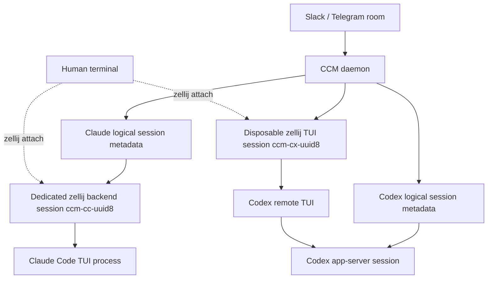
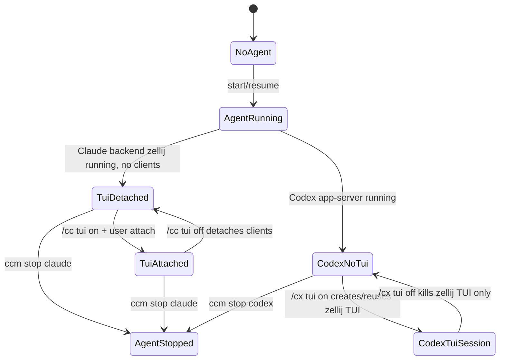
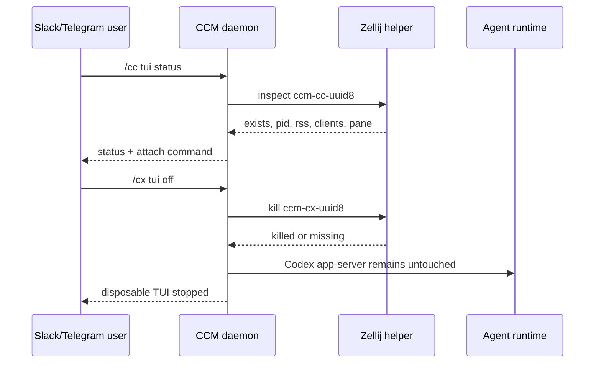

# feat: Add per-session zellij TUI lifecycle

## Summary

Add explicit `/cc tui on|off|status` and `/cx tui on|off|status` commands that make zellij TUI ownership visible and one-to-one per agent session. Claude sessions move from shared `ccmux` tabs to dedicated backend zellij sessions that keep Claude running without a connected human client by default. Codex keeps the app-server as its durable backend and uses a disposable dedicated zellij session only for the real Codex TUI.

This plan intentionally stays zellij-only. It does not introduce tmux or a custom PTY backend. The implementation must include telemetry and benchmark gates because this remedy reduces shared-server blast radius but does not prove that each Claude-owned zellij server will have acceptable RSS behavior.

---

## Problem Frame

The current CCM zellij model concentrates many Claude/Codex TUIs in one long-lived `ccmux` zellij server. A recent RCA showed that server reached tens of GB of private anonymous RSS while hosting a modest number of active TUI tabs. Detaching a human zellij client is not enough when the memory owner is the zellij server that still owns all panes and Claude child processes.

The requested remedy keeps the fully interactive zellij TUI experience on demand while avoiding the shared `ccmux` server as a many-session accumulator:

- Claude keeps running in zellij, but each Claude session gets its own backend zellij session.
- `/cc tui on` returns an attach command for that session.
- `/cc tui off` detaches/kills connected clients only and preserves the backend zellij server and Claude process.
- Codex app-server remains durable, while `/cx tui on` creates/reuses a dedicated disposable zellij TUI session and `/cx tui off` kills that zellij session.

---

## Requirements

- **R1. Claude one-to-one backend zellij:** each Claude logical session has a deterministic backend zellij session name and no longer launches as a tab inside shared `ccmux`.
- **R2. Claude TUI on:** `/cc tui on` reports a safe attach command for the current Claude session and starts/resumes the backend zellij session if required by existing start/resume behavior.
- **R3. Claude TUI off:** `/cc tui off` detaches or terminates connected zellij clients without killing the backend zellij server or Claude process.
- **R4. Codex disposable TUI:** `/cx tui on` creates or reuses a dedicated zellij session running the real Codex remote TUI connected to the existing Codex app-server session.
- **R5. Codex TUI off:** `/cx tui off` kills the Codex TUI zellij session while leaving the Codex app-server session running.
- **R6. Status and observability:** `/cc tui status` and `/cx tui status` expose backend session name, attach command, zellij server PID when available, client count when available, RSS, and whether the agent runtime remains alive.
- **R7. Existing command parity:** screen snapshots, navigation buttons, raw Claude slash passthrough, worker control tools, and transcript delivery continue to work against the new per-session zellij topology.
- **R8. Benchmark gate:** implementation includes a repeatable RSS measurement path comparing current shared `ccmux` behavior with per-session zellij behavior before treating the remedy as successful.

---

## Scope Boundaries

### In Scope

- Per-session zellij naming, launch, attach-command reporting, status lookup, and cleanup semantics for Claude and Codex TUI surfaces.
- Command parsing and user-facing notices for `/cc tui on|off|status` and `/cx tui on|off|status`.
- Refactoring zellij helpers so callers can target either shared `ccmux` during transition or a per-session backend.
- Tests for command parsing, lifecycle decisions, zellij command targeting, and Codex app-server preservation.
- Documentation describing the new TUI lifecycle and benchmark interpretation.

### Out of Scope

- Replacing zellij with tmux.
- Building a custom PTY host or terminal renderer.
- Removing Claude’s dependency on an interactive terminal.
- Changing Slack/Telegram room binding, Agent Control Path authorization, or worker-room orchestration semantics beyond preserving TUI control compatibility.

### Deferred to Follow-Up Work

- Automatic policy that switches all rooms to per-session zellij only after benchmark results prove the RSS slope is acceptable.
- Optional zellij config hardening such as custom low-retention worker configs, unless implementation discovers it is necessary for the spike to run safely.
- Upstream zellij bug report or bisect if per-session zellij still leaks.

---

## Key Technical Decisions

### KTD1. Use per-session zellij as the first zellij-only remedy

Claude remains zellij-hosted because the user requires a fully functioning interactive zellij TUI and rejected stopping Claude on `/cc tui off`. Moving from one shared `ccmux` host to one backend zellij session per Claude session isolates memory growth and makes per-session RSS visible without introducing a second multiplexer.

### KTD2. Treat Claude `/cc tui off` as client detach, not server kill

For Claude, the backend zellij server is the durable owner of the Claude TUI process. Killing that server would likely kill Claude. `/cc tui off` therefore detaches connected clients where zellij supports it and records/report best-effort results; it must not promise full memory release.

### KTD3. Treat Codex zellij as disposable

Codex app-server is already the durable runtime. Its zellij TUI session is only a remote UI client, so `/cx tui off` can kill the zellij session/server while preserving the Codex app-server and logical session metadata.

### KTD4. Centralize zellij session operations behind a target-aware helper

Existing helpers assume one `CHANNEL_DAEMON_ZELLIJ_SESSION` and use `zellij --session ccmux action ...`. The new model needs operations against per-agent session names, server PID/RSS lookup, client listing, session existence, session creation, session killing, pane lookup, snapshots, and key delivery. A target-aware helper avoids spreading session-name logic through daemon command branches.

### KTD5. Benchmark before declaring success

The plan reduces blast radius but does not prove zellij server memory is bounded when each Claude owns its own zellij server. A benchmark/telemetry unit is required so implementation can compare shared-host and per-session-host RSS slopes under similar TUI workloads.

---

## High-Level Technical Design

### Runtime ownership model

### TUI command state machine

### Command routing sketch

---

## System-Wide Impact

- **Human operators:** keep zellij-based full TUI interaction, but now attach to per-session commands instead of relying on tabs inside shared `ccmux`.
- **Slack/Telegram users:** get explicit TUI lifecycle commands and status text that distinguishes backend runtime from attached viewer/client state.
- **Orchestrators and Worker Rooms:** Agent Control Path continues to start, configure, task, and capture workers; plans must preserve raw Claude command delivery and worker task delivery semantics.
- **Operations:** zellij memory becomes observable per agent session, enabling safer cleanup and future automated policy decisions.

---

## Implementation Units

### U1. Add target-aware zellij session helper

**Goal:** Provide a reusable zellij helper that can operate on shared `ccmux`, per-Claude backend sessions, and disposable Codex TUI sessions without hard-coding one global session name.

**Requirements:** R1, R3, R4, R5, R6, R7

**Dependencies:** none

**Files:**
- `zellij.ts`
- `zellij-json.ts`
- `escort.ts`
- `test/zellij-session.test.ts`

**Approach:**
- Extend existing zellij utilities with deterministic session-name builders such as Claude backend and Codex TUI session names.
- Add target-aware wrappers for list sessions, create background session, run command in a session, kill session, list clients, list panes, list tabs, dump screen, send keys, and close tab/pane where still needed.
- Add best-effort server PID/RSS lookup based on zellij process command lines and session/socket metadata. Treat PID/RSS as optional because zellij CLI output may vary across versions.
- Keep existing shared-session helper behavior available during migration so unrelated `ccmux` behavior does not break.
- Do not embed raw user-supplied session names in shell strings; construct names from trusted runtime and UUID prefixes.

**Patterns to Follow:**
- `zellij.ts` currently holds formatting-safe zellij utilities.
- `zellij-json.ts` parses zellij JSON defensively.
- `escort.ts` wraps zellij action commands and handles unavailable sessions as non-fatal UI failures.

**Test Scenarios:**
- Given a Claude UUID, session-name builder returns a stable `ccm-cc-<uuid8>` style name and rejects malformed or empty IDs.
- Given a Codex UUID, session-name builder returns a stable `ccm-cx-<uuid8>` style name distinct from the Claude name.
- Given JSON from `list-clients`, parser returns client count and tolerates empty output.
- Given zellij command failure for optional RSS lookup, helper returns unknown RSS instead of throwing.
- Given a target session, helper builds zellij invocations using that target rather than the global `ccmux` default.

**Verification:** helper callers can target multiple zellij sessions in tests without mutating `CHANNEL_DAEMON_ZELLIJ_SESSION` globally.

### U2. Move Claude launch to dedicated backend zellij sessions

**Goal:** Change Claude start/resume so each logical Claude session is hosted by its own backend zellij session rather than a tab inside shared `ccmux`.

**Requirements:** R1, R2, R3, R7

**Dependencies:** U1

**Files:**
- `daemon.ts`
- `agents/claude/channel-driver.ts`
- `escort.ts`
- `test/room-control-daemon.test.ts`
- `test/zellij-session.test.ts`

**Approach:**
- Refactor `spawnClaude` so the zellij target is the Claude backend session name derived from the logical UUID.
- Preserve the existing Claude command construction: plugin args, development channel flags, settings file, allowed tools, forwarded routing environment, worktree cwd, and channel bridge env.
- Create or reuse the backend zellij session in background mode and run Claude inside it as the primary pane/session command.
- Replace stale shared-tab cleanup with backend-session stale detection. If a backend zellij session exists but the live bridge cannot reconnect, handle it as an explicit stale-backend state rather than silently killing running Claude.
- Keep `live.set(uuid, { runtime: claude, ... })` semantics tied to the Claude channel bridge, not to human zellij attachment.

**Patterns to Follow:**
- `daemon.ts` already builds Claude launch args in one place and documents why direct background spawn is not viable.
- `ClaudeChannelAgentDriver` delegates process start/resume to daemon-provided spawn functions.
- Existing worktree isolation in `spawnClaude` must remain unchanged.

**Test Scenarios:**
- Starting a new Claude session calls the zellij helper with a per-session backend name rather than shared `ccmux`.
- Resuming a Claude session reuses the deterministic backend session name and preserves `--resume` args.
- Launch command still includes `CC_CHANNEL_SESSION_UUID`, `CC_CHANNEL_DAEMON_SOCK`, forwarded routing env, settings file, and allowed tools.
- If backend zellij creation fails, start fails with a clear error and does not fall back to non-interactive direct spawn.
- Existing worker-agent start paths still receive an `ok: true` result once the Claude channel driver records the session.

**Verification:** Claude sessions can start/resume with no human zellij client attached, and command construction remains equivalent except for zellij target topology.

### U3. Add `/cc tui on|off|status` command handling

**Goal:** Add explicit Claude TUI lifecycle commands that expose attach instructions, detach connected clients best-effort, and report backend state without killing Claude.

**Requirements:** R2, R3, R6, R7

**Dependencies:** U1, U2

**Files:**
- `commands.ts`
- `daemon.ts`
- `test/commands.test.ts`
- `test/room-control-daemon.test.ts`

**Approach:**
- Extend command parsing to recognize `tui on`, `tui off`, and `tui status` for `/cc` and equivalent Claude runtime forms.
- Implement a daemon command branch that resolves the room’s Claude UUID, ensures the backend exists when appropriate, and returns a shell-safe `zellij attach <session>` command.
- For `/cc tui off`, list connected clients and perform the safest available detach strategy. If zellij does not expose targeted client kill, report that no targeted client kill is available and instruct the user to close/detach their attached client; do not kill the backend server.
- For `/cc tui status`, include backend session name, attach command, session existence, optional server PID/RSS, client count, pane status, and live bridge status.
- Make user-facing copy explicit that Claude continues in the backend zellij session after `tui off`.

**Patterns to Follow:**
- `commands.ts` keeps parsing helpers small and string-based.
- Existing daemon command branches send concise `formatAgentReply(...)` notices and buttons where helpful.
- Existing `/cc ss` and nav failure messages already distinguish runtime-specific instructions.

**Test Scenarios:**
- `/cc tui on` parses as a Claude TUI command with action `on`.
- `/cc tui off` parses as a Claude TUI command with action `off`.
- `/cc tui status` parses as a Claude TUI command with action `status`.
- `/cc tui on` with no bound Claude session returns a start/resume prompt rather than inventing a UUID.
- `/cc tui on` with a bound session returns the expected attach command and does not start a duplicate Claude process.
- `/cc tui off` never calls zellij kill-session for Claude backend sessions.
- `/cc tui status` renders unknown PID/RSS/client details gracefully when the helper cannot discover them.

**Verification:** Claude TUI command handling is safe-by-default: it cannot accidentally kill the backend zellij session that owns Claude.

### U4. Make Codex remote TUI disposable per session

**Goal:** Change Codex TUI lifecycle so each Codex app-server session can create/reuse/kill a dedicated zellij TUI session independent of the durable app-server runtime.

**Requirements:** R4, R5, R6, R7

**Dependencies:** U1

**Files:**
- `agents/codex/session.ts`
- `agents/codex/app-server-driver.ts`
- `daemon.ts`
- `test/codex-session.test.ts`
- `test/room-control-daemon.test.ts`

**Approach:**
- Extend `CodexAppServerSession` TUI abstraction so its target is a dedicated zellij session name, not only a tab name inside shared `ccmux`.
- Preserve app-server start/resume as the durable Codex runtime; TUI attach must remain optional and idempotent.
- Implement `/cx tui on` to create/reuse the dedicated zellij session running the real Codex remote TUI command against the session’s app-server URL and native session ID.
- Implement `/cx tui off` to kill only the dedicated Codex TUI zellij session and leave `codexSessions`, `codexSessionMap`, app-server process, pending requests, and transcript metadata intact.
- Keep stuck-working reconciliation scoped to disposable TUI sessions: restarting a stale TUI must not restart the app-server unless existing app-server health checks require it.

**Patterns to Follow:**
- `agents/codex/session.ts` already separates app-server `start/resume/stop` from `attachTui` and has tests for TUI reuse, stale pane closure, and stuck-working reconciliation.
- Existing `codexRemoteTuiCommand(...)` should remain the source of the remote TUI command.

**Test Scenarios:**
- `/cx tui on` for an existing Codex app-server session creates a zellij TUI session and returns an attach command.
- Calling `/cx tui on` twice reuses the existing matching TUI session and does not create duplicate zellij sessions.
- `/cx tui off` kills the zellij TUI session and does not call the Codex app-server driver stop method.
- A stale Codex TUI connected to the wrong app-server URL is replaced without touching the app-server session metadata.
- If no Codex app-server session exists, `/cx tui on` returns a start/resume prompt.
- Existing `attachTui` in-flight de-duplication still prevents concurrent duplicate launches.

**Verification:** Codex TUI can be turned off and on repeatedly while the app-server session identity and transcript mapping remain stable.

### U5. Retarget screen, nav, and raw-command paths to backend sessions

**Goal:** Preserve existing interactive controls after zellij topology changes.

**Requirements:** R7

**Dependencies:** U1, U2, U3, U4

**Files:**
- `daemon.ts`
- `escort.ts`
- `test/claude-nav.test.ts`
- `test/codex-session.test.ts`
- `test/room-control-daemon.test.ts`

**Approach:**
- Replace `resolvePaneId(uuidShort)` assumptions that look for `ccm:<uuid8>` inside shared `ccmux` with runtime-aware resolution through the new zellij helper.
- For Claude, resolve the primary pane in the backend zellij session for snapshots, dialog detection, navigation, and `sendClaudePaneRawCommand`.
- For Codex, resolve the pane in the disposable TUI zellij session when attached; if the Codex TUI session is absent, screen/nav commands should report that the TUI is off and offer `/cx tui on`.
- Keep `dumpScreen` and `sendKeys` wrappers target-aware so watchers and callbacks do not accidentally target shared `ccmux`.
- Ensure worker raw-command delivery for Claude remains supported because orchestration setup depends on native slash command passthrough.

**Patterns to Follow:**
- Existing `sendClaudePaneRawCommand` writes raw chars and Enter to the Claude pane, then updates dialog watcher state.
- Callback nav currently checks Codex pane status before falling back to Claude; preserve runtime discrimination while changing pane lookup mechanics.

**Test Scenarios:**
- Claude `/cc ss` resolves and dumps the pane from `ccm-cc-<uuid8>` rather than shared `ccmux`.
- Claude raw slash passthrough sends keys to the backend zellij session and reports `delivery: claude_pane`.
- Claude inline nav callbacks use the backend zellij session and fail clearly when no pane exists.
- Codex nav/snapshot reports TUI-off state when the disposable zellij TUI session is absent.
- Codex nav/snapshot uses the disposable zellij TUI session when present.
- Worker `send_worker_raw_command` still succeeds for a started Claude worker after the topology change.

**Verification:** no caller still assumes every TUI pane lives in a tab named `ccm:<uuid8>` inside shared `ccmux`, except for explicitly legacy compatibility paths retained during migration.

### U6. Add telemetry and benchmark gate for zellij RSS behavior

**Goal:** Make the remedy measurable before declaring it successful.

**Requirements:** R6, R8

**Dependencies:** U1, U2, U4

**Files:**
- `daemon.ts`
- `scripts/measure-zellij-tui-memory.ts`
- `docs/per-session-zellij-tui.md`
- `test/zellij-session.test.ts`

**Approach:**
- Add daemon-visible status helpers that report zellij backend PID/RSS when discoverable and mark values unknown when not.
- Add a bounded measurement script that samples zellij server RSS for shared `ccmux`, per-Claude backend sessions, and Codex disposable TUI sessions without requiring secrets in output.
- The script should support manual comparison runs; it should not fabricate Claude/Codex workloads that require credentials unless explicitly configured by the operator.
- Document the success gate: per-session zellij should show bounded or materially lower RSS slope than shared `ccmux` under comparable active session counts.
- Redact command lines and environment values in all measurement output because zellij pane command metadata may include routing/auth env.

**Patterns to Follow:**
- Existing scripts under `scripts/` are Bun/TypeScript utilities for orchestration and smoke validation.
- Existing docs under `docs/` explain operator checklists and spike results.

**Test Scenarios:**
- RSS parser extracts numeric `VmRSS` and `RssAnon` from `/proc/<pid>/status` fixtures.
- RSS parser handles missing process/status files by returning unknown values.
- Measurement output redacts env-looking secrets and long command lines.
- Status formatter shows unknown RSS without failing TUI status commands.

**Verification:** operators can compare shared and per-session zellij memory slopes and decide whether to proceed with rollout or revisit the architecture.

### U7. Document operator UX and migration notes

**Goal:** Make the new TUI lifecycle understandable for room users and operators.

**Requirements:** R2, R3, R4, R5, R6, R8

**Dependencies:** U3, U4, U6

**Files:**
- `README.md`
- `docs/per-session-zellij-tui.md`
- `CONCEPTS.md`

**Approach:**
- Document `/cc tui on|off|status` and `/cx tui on|off|status` with explicit differences between Claude backend ownership and Codex disposable TUI ownership.
- Explain that Claude `/cc tui off` detaches clients and keeps Claude alive, but does not kill the backend zellij server.
- Explain that Codex `/cx tui off` kills only the disposable TUI session because app-server is durable.
- Add glossary entries only for project-specific terms introduced by the feature, such as Backend Zellij Session and Disposable Codex TUI Session.
- Include the benchmark gate and interpretation guidance without embedding sensitive local process examples.

**Patterns to Follow:**
- `CONCEPTS.md` defines durable CCM domain terms concisely.
- README command documentation should stay user-facing and avoid internal implementation detail unless needed to prevent misuse.

**Test Scenarios:**
- Test expectation: none -- documentation-only unit; behavior is covered by command and lifecycle tests in U3, U4, U5, and U6.

**Verification:** a new operator can understand which commands preserve Claude, which commands kill only viewer state, and how to inspect memory status.

---

## Risks & Mitigations

- **Per-session zellij still leaks:** benchmark gate in U6 prevents declaring success from topology alone; follow-up may need zellij config hardening, tmux, or a custom PTY host.
- **Total base memory increases:** many zellij servers may cost more idle memory than one shared server; status and benchmark output must report total and per-session RSS.
- **Targeted client kill may not be supported:** zellij exposes `list-clients` and `detach`, but targeted client termination may require PID tracking or user action. `/cc tui off` must report best-effort results rather than pretending clients were killed.
- **Command metadata may expose secrets:** zellij pane command output can include environment values. Telemetry and docs must redact command lines and never echo raw env values into Slack/Telegram.
- **Worker control regression:** Claude raw slash passthrough is required by Agent Control Path setup. U5 explicitly verifies `send_worker_raw_command` still reaches the Claude pane.
- **Operational clutter:** per-session zellij creates more sessions in `zellij list-sessions`; deterministic names and status docs mitigate discoverability issues.

---

## Open Questions

- Can zellij reliably detach or terminate a specific connected client by ID in the installed version, or will `/cc tui off` need to be best-effort plus user instruction?
- Should per-session zellij become the default immediately after implementation, or remain behind a feature flag until benchmark results are reviewed?
- Should Codex TUI sessions be created only by `/cx tui on`, or should existing flows that currently auto-attach Codex TUI continue to do so under the new disposable session model?

---

## Acceptance Examples

- **AE1. Claude attach command:** Given a room with Claude session `abcdef12...`, when the user sends `/cc tui on`, CCM replies with `zellij attach ccm-cc-abcdef12` and does not create a second Claude process.
- **AE2. Claude off preserves runtime:** Given an attached Claude TUI client, when the user sends `/cc tui off`, CCM detaches/kills connected clients best-effort, reports the backend zellij session remains running, and the Claude channel bridge can still receive turns.
- **AE3. Codex off preserves app-server:** Given a Codex app-server session with a disposable zellij TUI session, when the user sends `/cx tui off`, CCM kills the zellij TUI session and subsequent Codex app-server turns still run in the same logical session.
- **AE4. Status is honest:** Given PID/RSS lookup is unavailable, when the user sends `/cc tui status`, CCM reports unknown memory fields instead of failing or inventing values.
- **AE5. Benchmark gate:** Given a measurement run comparing shared and per-session zellij topologies, the output redacts secrets and reports enough RSS samples to compare slope.

---

## Sources & Research

- Existing Claude launch path: `daemon.ts` builds Claude args/env and starts a zellij tab in shared `ccmux`.
- Existing Codex TUI path: `agents/codex/session.ts` separates app-server start/resume from remote TUI attachment and already tests TUI reuse/stale replacement.
- Existing zellij helpers: `escort.ts`, `zellij.ts`, and `zellij-json.ts` centralize session parsing, pane lookup, screen dumps, key sends, and close-tab behavior.
- Existing command parser: `commands.ts` and daemon command branches handle `/cc` and `/cx` command bodies including screen/nav/slash passthrough.
- Existing domain terms: `CONCEPTS.md` defines CCM Daemon, Agent Routing Environment, Agent Control Path, Worker Room, and related control boundaries.
- Existing design context: `docs/codex-cli-native-driver-spike.md` recommends Codex app-server as production-safe default while improving zellij observability around it.
